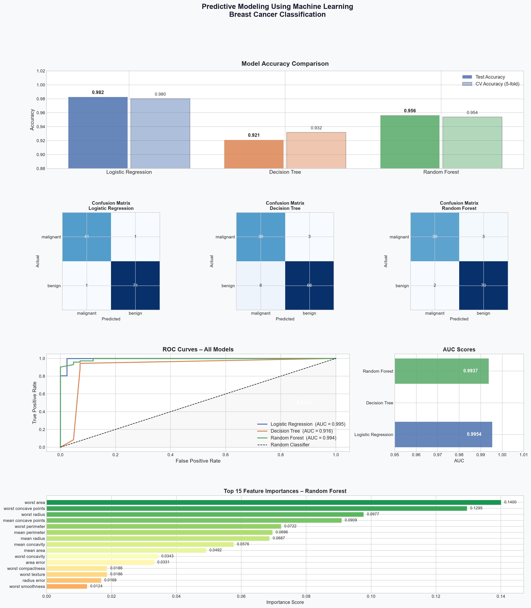

# predictive-modeling-ml
Breast cancer classification using Logistic Regression, Decision Tree &amp; Random Forest — with confusion matrices, ROC curves, and 98% accuracy.
# 🧠 Predictive Modeling Using Machine Learning

> Build a model to predict outcomes based on given data using supervised learning algorithms.

---

## 📌 About the Project

This project applies machine learning to classify tumors as **malignant or benign** using the Breast Cancer Wisconsin dataset. It covers the full ML pipeline — data loading, preprocessing, model training, evaluation, and visualization.

---

## 📊 Dataset

| Property | Details |
|---|---|
| Source | `sklearn.datasets` — Breast Cancer Wisconsin |
| Samples | 569 |
| Features | 30 (radius, texture, perimeter, area, etc.) |
| Target | Malignant (0) / Benign (1) |

---

## 🤖 Models Used

- ✅ Logistic Regression
- ✅ Decision Tree
- ✅ Random Forest

---

## 📈 Results

| Model | Test Accuracy | CV Accuracy | AUC Score |
|---|---|---|---|
| **Logistic Regression** | **98.25%** | **98.02%** | **0.9954** |
| Random Forest | 95.61% | 95.38% | 0.9937 |
| Decision Tree | 92.11% | 93.19% | 0.9163 |

🏆 **Best Model: Logistic Regression** with 98.25% accuracy and AUC of 0.9954

---

## 📉 Visualizations



---

## 🔍 Key Features

- 80/20 stratified train-test split
- 5-fold cross validation
- Feature scaling with StandardScaler
- Confusion matrices for all models
- ROC curves with AUC scores
- Top 15 feature importances (Random Forest)
- Classification reports with precision, recall & F1

---

## 🛠️ Tech Stack


---

## ▶️ How to Run

**1. Clone the repository**
```bash
git clone https://github.com/your-username/predictive-modeling-ml.git
cd predictive-modeling-ml
```

**2. Install dependencies**
```bash
pip install scikit-learn pandas numpy matplotlib seaborn
```

**3. Run the script**
```bash
python predictive_modeling.py
```

---

## 📁 Project Structure
📦 predictive-modeling-ml

┣ 📜 predictive_modeling.py       # Main ML script

┣ 📊 ml_predictive_modeling_report.png  # Output visualization

┗ 📄 README.md                    # Project documentation

---

## 🎯 Expected Outcome

Gain hands-on experience in supervised learning, model comparison, and performance evaluation using real-world medical data.

---

## 👤 Author

Gonuguntla Harsha Vardhan
